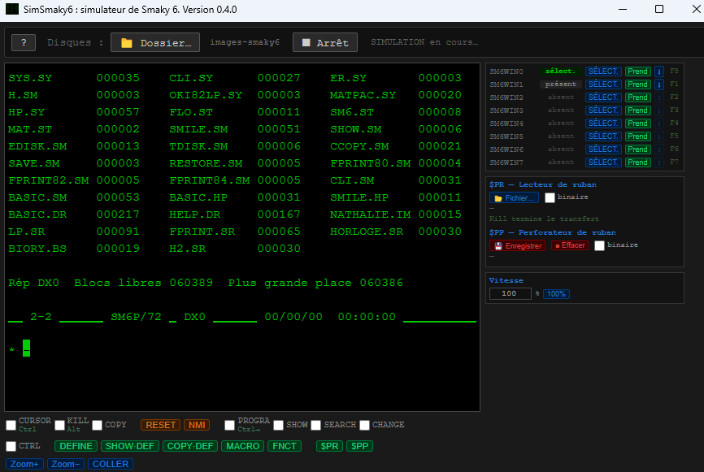

# Simulateur Smaky 6 en JavaScript

Le Smaky 6, ordinateur suisse conçu en 1978 par Epsitec, est aujourd'hui rare à trouver en état de marche.
Pour permettre à toute personne curieuse de découvrir cette machine sans en posséder une, ce dossier contient un simulateur logiciel qui reproduit fidèlement son comportement : émulation complète du processeur Z80, de l'écran texte et graphique, du clavier, du contrôleur de disque dur WD1002 et des autres périphériques.

Le simulateur est écrit en JavaScript et empaqueté avec [Electron](https://www.electronjs.org/) pour fonctionner aussi bien sous Windows que sous Linux. Il charge la ROM 1.8 d'origine du Smaky 6 (libérée par Epsitec pour redistribution ouverte) et lit des images de disques au format Smaky.

## Téléchargements (version 0.5.0)

- **Windows** (installeur NSIS) : [Smaky 6 Simulator Setup 0.5.0.exe](https://github.com/SMUG-2-0/Smaky-6/releases/download/v0.5.0/Smaky.6.Simulator.Setup.0.5.0.exe)
- **Linux** (archive autonome) : [smaky6-simulator-0.5.0.tar.gz](https://github.com/SMUG-2-0/Smaky-6/releases/download/v0.5.0/smaky6-simulator-0.5.0.tar.gz)

Toutes les versions sont disponibles sur la [page des releases](https://github.com/SMUG-2-0/Smaky-6/releases).

L'installeur Windows n'est pas signé numériquement (pas de certificat de signature de code).
Microsoft Defender SmartScreen affichera un avertissement « Microsoft Defender SmartScreen a empêché un démarrage non reconnu ».
Cliquer sur **Informations complémentaires → Exécuter quand même**.



## Construire depuis les sources

Le simulateur dépend de Node.js. Une fois le dépôt cloné :

```
cd Simulateur-JS
npm install
npm start
```

Pour produire les installateurs, voir [release.md](release.md). Pour les détails techniques de la conception (émulation Z80, ports, écran, etc.), voir [simsmaky6.md](simsmaky6.md).

## Licence

Code MIT, copyright © 1978-2026 Epsitec SA. Voir le fichier [LICENSE](LICENSE).
